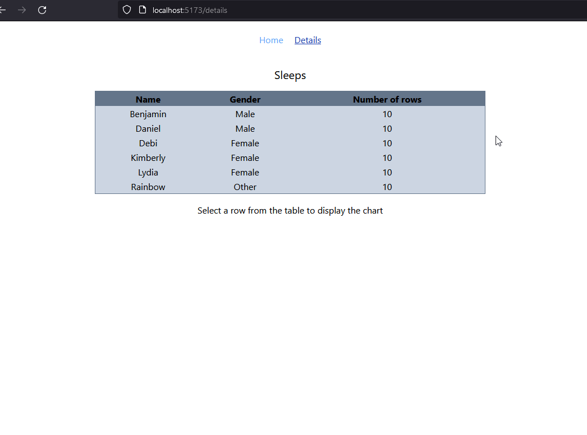
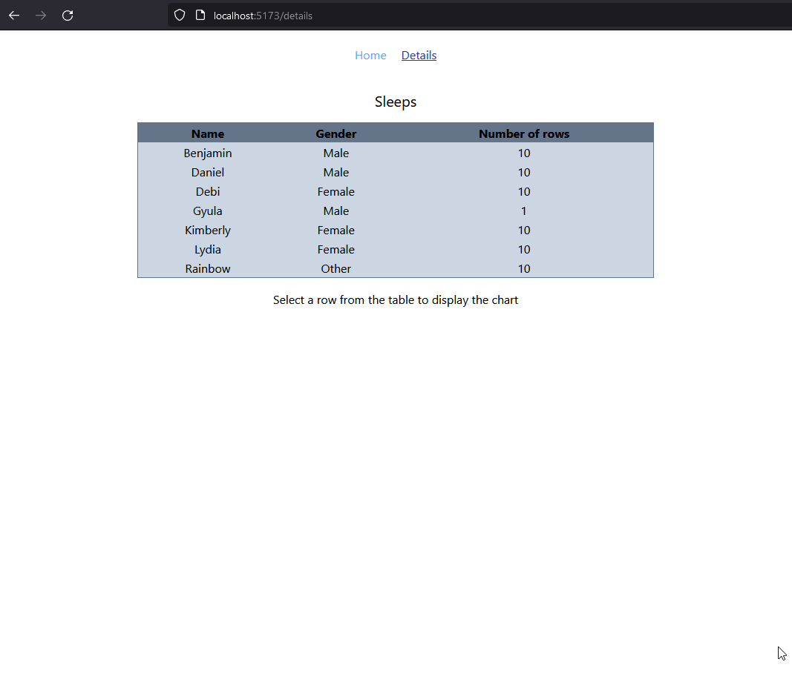
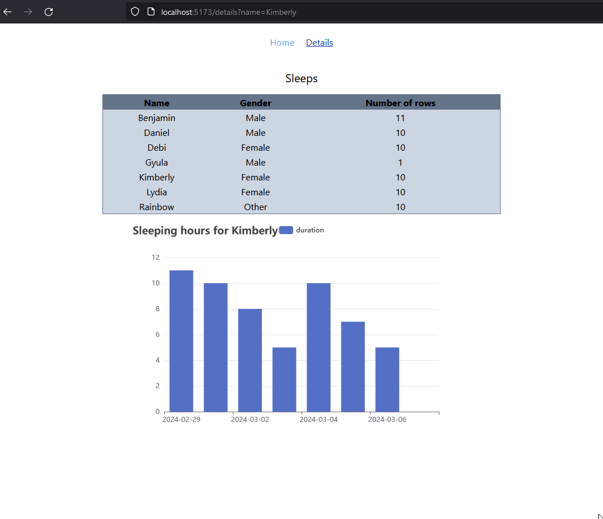
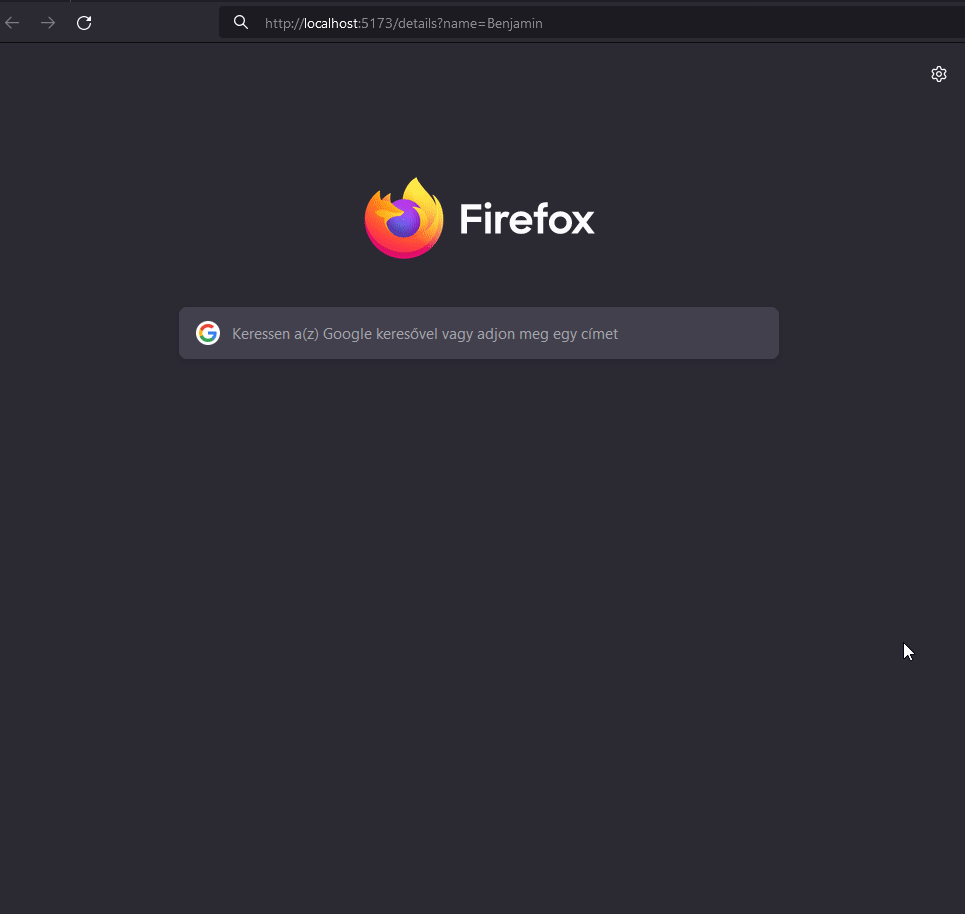

# Sleep tracker app

## Run the apps:

### Config:

backend:

create .env file in the frontend folder:
| env variable | example
| --- | --- |
|`MONGO_URI` | `mongodb+srv://...` |

frontend:

create .env file in the frontend folder:
| env variable | example
| --- | --- |
|`VITE_API_URL` | `http://localhost:3000` |

### backend (NestJS app):

```bash
$ cd backend
$ npm install

# development
$ npm run start

# watch mode
$ npm run start:dev

# production mode
$ npm run start:prod
```

you can optionally populate the database with sample data:
(6 different names, and 10 random data for the last last 10 days for each name)

http://localhost:3000/api/sleeps/seed

app is running on: http://localhost:3000/

### frontend (React vite app):

```bash
$ cd frontend
$ npm i

# development
$ npm run dev
```

app is running on: http://localhost:5173/

## Tasks:

- [x]: (frontend): build a form
- [x]: (frontend): create a page with a table
- [x]: (frontend): create a chart with echart
- [x]: (backend): setup mongoose
- [x]: (backend): seed db with sample data
- [x]: (backend): POST route for create new entry
- [x]: (backend): GET route for populate the table
- [x]: (backend): GET route for populate the chart

## Screenshots:

| task                                                                        | demo                                                                               |
| --------------------------------------------------------------------------- | ---------------------------------------------------------------------------------- |
| submit the form for a new user                                              |                         |
| display table and chart data                                                |  |
| add new record for an existing user                                         |                   |
| if name is passed as a query param, it will display the chart automatically |                         |
